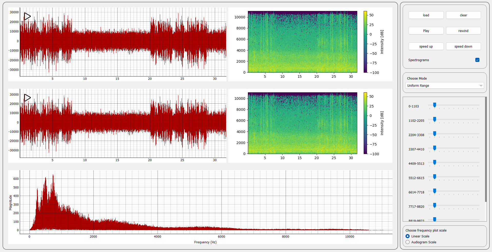
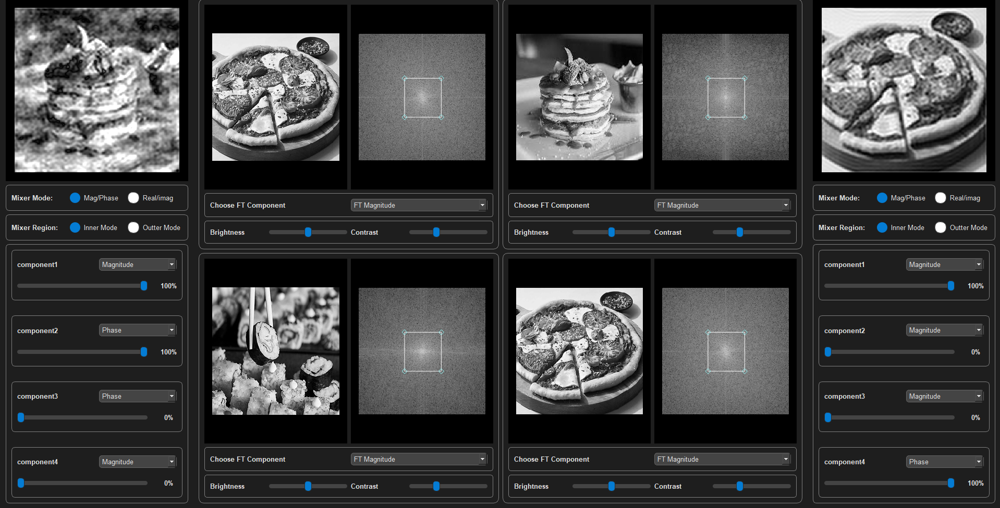
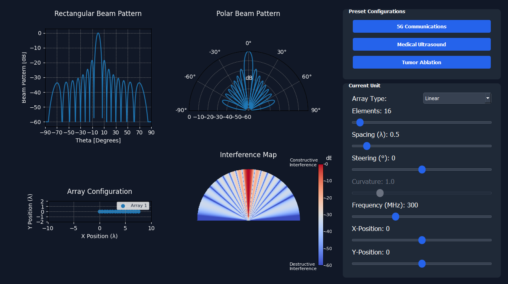
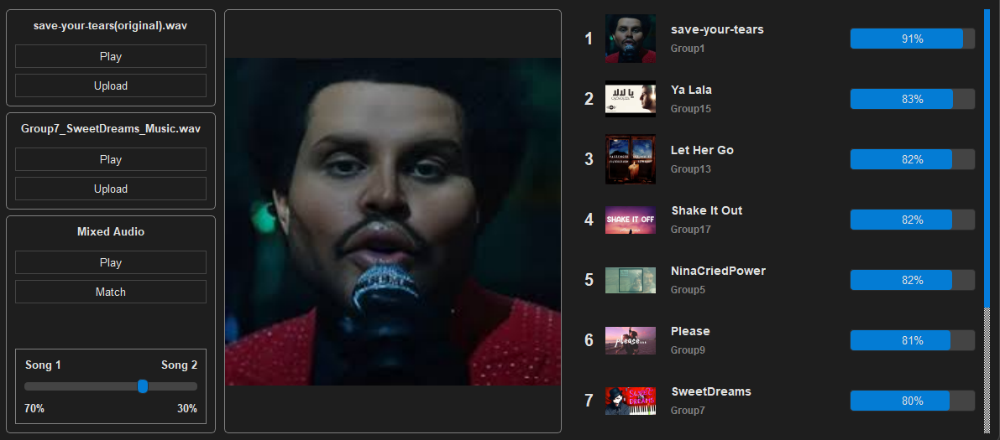
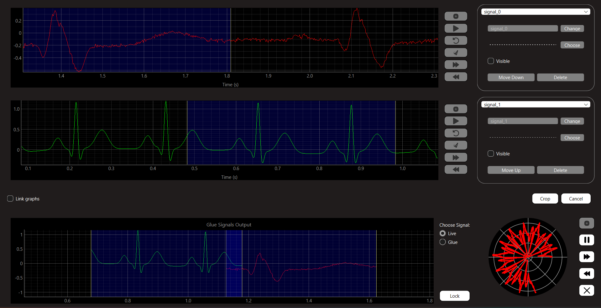
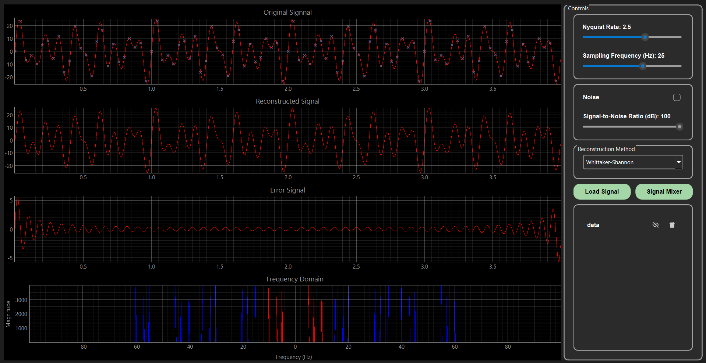

# Digital Signal Processing Hub

Welcome to the **Digital Signal Processing Hub**, a collection of innovative desktop applications exploring various aspects of signal processing, visualization, and manipulation. Each application is carefully designed to provide interactive, educational, and practical experiences with real-world applications.

## applications Overview

### Signal Equalizer

  

 

A desktop app for adjusting signal frequencies in real time. Features include Fourier visualization, noise removal, and multiple modes such as:

<ul>
  <li><strong>Uniform Range</strong>: Adjust frequencies with equal emphasis across the spectrum.</li>
  <li><strong>Music & Vowels Mix</strong>: Fine-tune signals specific to vocal and instrumental harmonics.</li>
  <li><strong>Music & Animals Mix</strong>: Blend and isolate frequencies in animal vocalizations and music.</li>
  <li><strong>Wiener Filter</strong>: Advanced noise reduction using statistical methods.</li>
  <li><strong>Custom Presets</strong>: Save and apply custom equalizer settings.</li>
</ul>

### FT-Mixer

  

 

Demonstrate the importance of magnitude and phase in 2D Fourier transforms using images. Key features:

<ul>
  <li><strong>Image Manipulation</strong>: Modify and explore Fourier Transform components.</li>
  <li><strong>Mixing Modes</strong>: Experiment with magnitude/phase or real/imaginary domains.</li>
  <li><strong>Region-Based Mixing</strong>: Apply mixing to specific regions of images.</li>
  <li><strong>Interactive Visualizations</strong>: Gain insights into Fourier properties through visual feedback.</li>
</ul>

### Beamforming Simulator

  

 

Simulate 2D beamforming with customizable parameters such as transmitter/receiver configurations, phase shifts, and frequencies. Highlights:

<ul>
  <li><strong>Real-Time Beam Steering</strong>: Visualize dynamic beam adjustments.</li>
  <li><strong>Phased Array Units</strong>: Explore multiple unit configurations.</li>
  <li><strong>Pre-Configured Scenarios</strong>: Analyze 5G communication, ultrasound imaging, and tumor ablation setups.</li>
  <li><strong>User-Defined Parameters</strong>: Adjust configurations for custom experiments.</li>
</ul>

### Fingerprint

  

 

A music and vocals identification app based on spectrograms and perceptual hashing. Features include:

<ul>
  <li><strong>Spectrogram Generation</strong>: Visualize audio signals for detailed analysis.</li>
  <li><strong>Feature Extraction</strong>: Extract meaningful characteristics from audio files.</li>
  <li><strong>Perceptual Hashing</strong>: Create unique fingerprints for songs.</li>
  <li><strong>Similarity Search</strong>: Identify similar songs or vocals using advanced search algorithms.</li>
  <li><strong>Weighted Mixing</strong>: Blend audio signals with customizable weighting.</li>
</ul>

### Multi-Channel Signal Viewer

  

 

A real-time visualization tool for multi-channel signals (e.g., ECG, EEG). Features include:

<ul>
  <li><strong>Linked Cine Viewers</strong>: Analyze multiple channels synchronously.</li>
  <li><strong>Signal Manipulation</strong>: Transfer, crop, and glue signals seamlessly.</li>
  <li><strong>Radar Visualization</strong>: Generate intuitive radar views for signal patterns.</li>
  <li><strong>Exportable Reports</strong>: Create detailed PDF reports for analysis and documentation.</li>
</ul>

### Sampling Theory Studio

  

 

Explore signal sampling and reconstruction based on the Nyquist-Shannon theorem. Features include:

<ul>
  <li><strong>Signal Mixing</strong>: Combine multiple signal sources for analysis.</li>
  <li><strong>Sampling Control</strong>: Interactive sampling rate adjustments.</li>
  <li><strong>Noise Addition</strong>: Simulate and analyze noise effects on sampled signals.</li>
  <li><strong>Aliasing Investigation</strong>: Visualize aliasing phenomena.</li>
  <li><strong>Reconstruction Methods</strong>: Experiment with methods such as Lanczos, Cubic Spline, Zero-Order Hold, and more.</li>
</ul>

## Contributors

- **Ahmed Amgad Elsharkawy**: [GitHub Profile](https://github.com/AhmedAmgadElsharkawy)
- **Abdullah Mahmoud Hanafy**: [GitHub Profile](https://github.com/AbdullahMahmoudHanafy)
- **Mohamad Ahmed Ali**: [GitHub Profile](https://github.com/MohamadAhmedAli)
- **Rawan Ahmed**: [GitHub Profile](https://github.com/RawanAhmed444)
